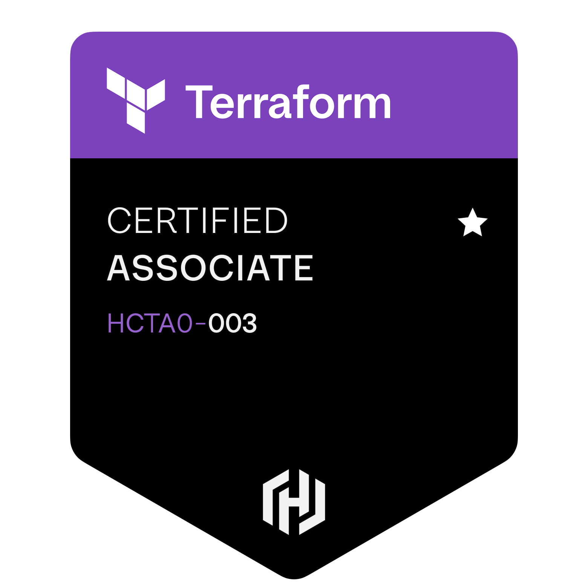
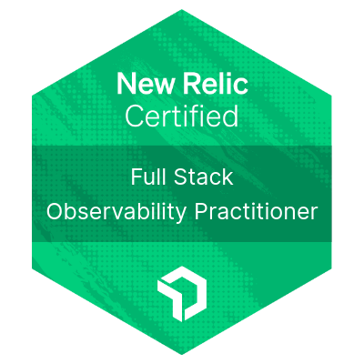

### <h1 align="center">Hi, I am Cristian Meoño </h1>

## I'm a Computer Science Engineer student
- ⚡ ReactJS, NodeJS and Go are my strongest programming skills
- 🔭 I’m currently working as DevOps Engineer at nClouds. 
- 💬 Ask me about ReactJS, NodeJS, Golang and Hardware
- 🌱 I’m currently learning about Cloud Native technologies and improving my DevOps skills
---

### Certifications

### ⚙️ &nbsp;GitHub Analytics

### Skills:

#### FrontEnd 💻

#### BackEnd 🔧

#### Databases 💾

#### DevOps ☁️

#### Learning 👀

<!--
**CristianFrancisco85/CristianFrancisco85** is a ✨ _special_ ✨ repository because its `README.md` (this file) appears on your GitHub profile.

Here are some ideas to get you started:

- 🔭 I’m currently working on ...
- 🌱 I’m currently learning ...
- 👯 I’m looking to collaborate on ...
- 🤔 I’m looking for help with ...
- 💬 Ask me about ...
- 📫 How to reach me: ...
- 😄 Pronouns: ...
- ⚡ Fun fact: ...
-->
